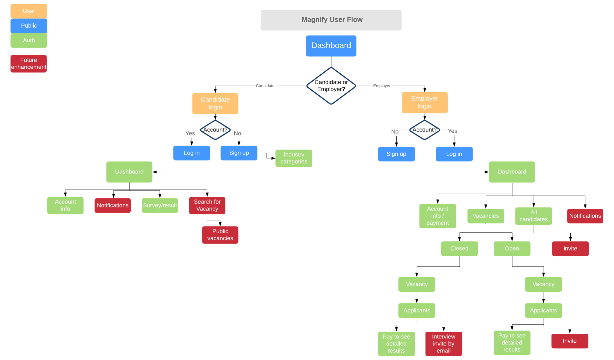
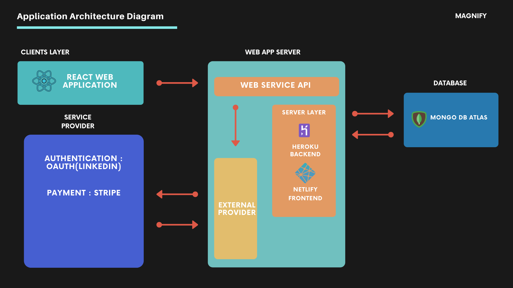
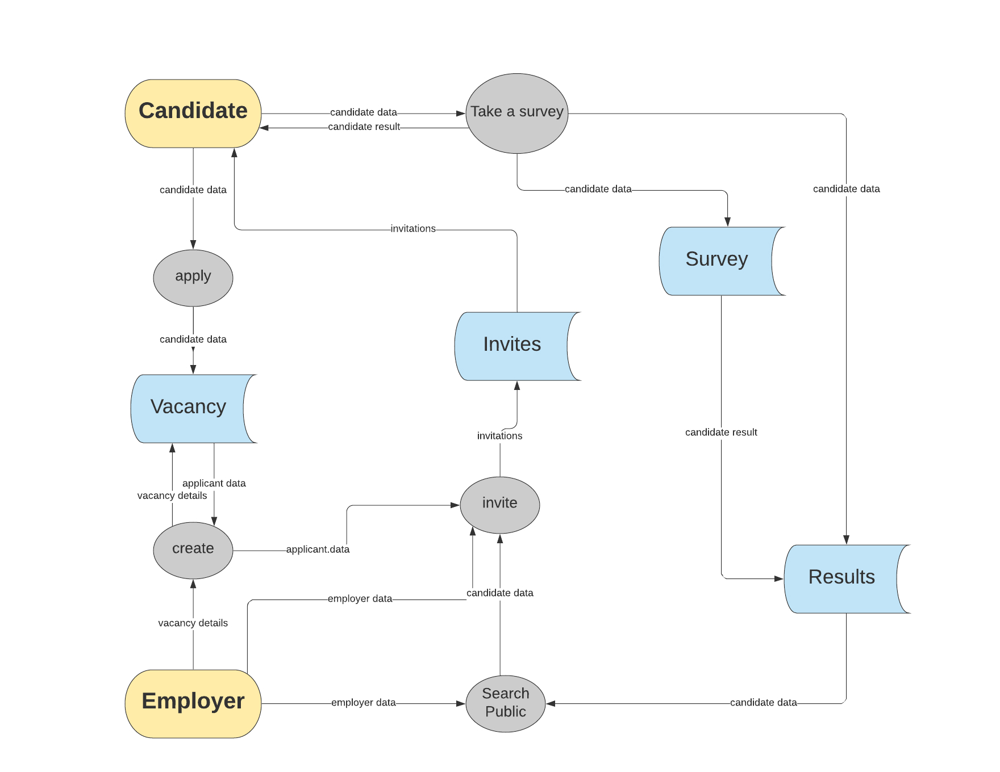
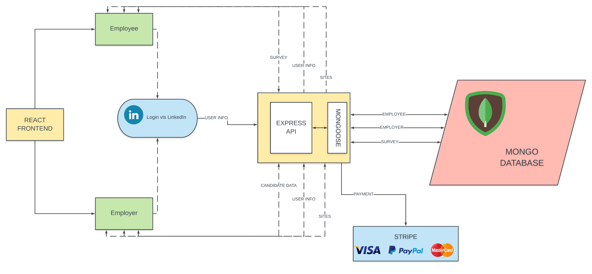
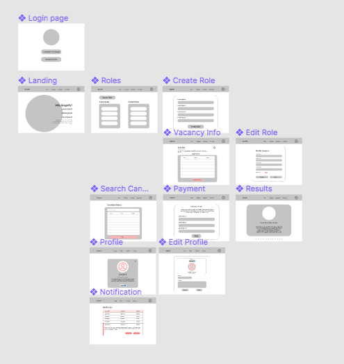
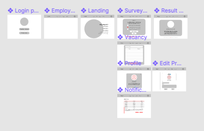
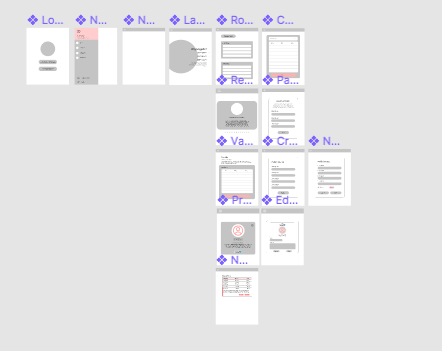
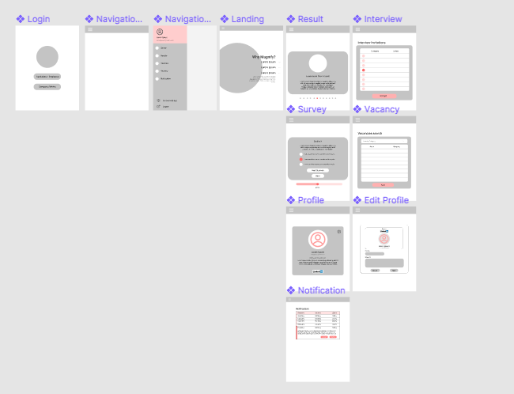
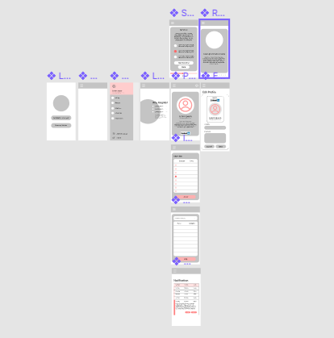

# Magnify Web Application

## Summary

Magnify is a cross-platform application that provides prospective employers a hassle free candidate rating system.

### Purpose and Target Audience

Finding good candidates to interview for job positions is a long and difficult process. Magnify helps bring the information hiring managers need to make educated decisions before the interview process. With the target audience being hiring managers and prospective employers, the application is aimed at providing a smooth and informative user experience to help find lasting employees.

The core functionality revolves around a survey that produces a psychological profile on candidates. The client requested a web platform to bring the survey into the public eye.

### Functionality/Features

- Employers can use a link to bring potential candidates found externally into Magnify in order to complete the survey.

- All users log in using their LinkedIn information. This removes the need for users to put any information that they would already have listen on the LinkedIn platform.

- Employers can create Vacancies for potential applicants to apply.

- The survey and overall site is well presented and easy to navigate.

### Technologies

Core technologies:

- Javascript
- MongoDB for the database
- Git and Github for version control

The Javascript MERN Stack for frameworking functionality

- MongoDB (With Mongoose for Object Data Modeling)
- Express (Node Web API Platform)
- React (Client side Rendering)
- Nodejs (Server side Javascript)

For deployment and cloud databasing

- [Heroku for Backend](https://www.heroku.com/)
- [Netlify for Frontend](https://www.netlify.com/)
- [Cloud Atlas MongoDB](https://www.mongodb.com/cloud/atlas)

## Design Documents

### Userflow Diagram

### Application Architecture

### Dataflow Diagram

### Architecture Dataflow

### Wireframes

#### Desktop Views

##### Employer Desktop

##### Candidate Desktop

#### Large Devices Views

##### Employer Large Device

##### Candidate Large Device

#### Mobile Views

##### Employer Mobile

##### Candidate Mobile

## Agile Processess

In order to organise the team effectively we chose to work with a variation of the agile framework Scrum. Using no official roles under the scrum framework we instead took Scrum events/ceremonies and artifacts to self organise our team. 

For staying on track the team uses the scrum ceremonies of daily standups and sprint planning and retrospectives. 

The core structure we use is the backlog of user stories and epics. These are actionable descriptions of what the application provides the end user. This allows the development process to be user focused. From the backlog we take a selection of stories the team believes we can achieve in a sprint cycle.

## User Stories

As part of the agile environment user stories form the basis for any work that is to be completed. At this stage of development we have decided on four epics that will guide the application.

### (Survey Epic) As a candidate I should be able to complete the survey that matches me with potential employers so that I can be hired by a company that fits my culture

- As a candidate I should be able to navigate easily to the survey so that I can complete it quickly

- As a candidate I should be able to navigate all throughout the survey before submitting so that I can change my answers

- As a candidate I should be able to see my survey progress so that I am well informed on my progress

- As an employer I should be able to invite users to the platform to complete the survey so that I can view results

- As a candidate I should be able to come back to an uncompleted survey so that I do not need to start over

- As a candidate I should be able to interact with a user interface that is easy to understand so that I do not need to learn anything new

### (Result Epic) As an employer I should be able to view candidate's survey results so that I can hire the best candidates

- As an employer I should only be able to view candidates that have completed the survey recently so that I am getting relevant and accurate information

- As an employer I should be able to send an interview invitation to a candidate so that I do not need to contact them outside the platform

- As an employer I should be able to pay to view a detailed description of my candidates results so that I can form a complete picture of the candidate

### (Auth Epic) As a Magnify User I should be able to sign in with only my LinkedIn account for an easier sign up experience

- As a visitor to the website I should be able to view a description of Magnify's services so that I can be incited to join

- As a Magnify user no site visitor's can view my information without being authenticated so that my privacy is respected

- As a candidate no other user can edit my profile so that I can maintain my privacy

- As a user my Magnify account information should be my up to date LinkedIn information so that I do not need excessive maintenance on my account

- As a recruitment manager I should be able to use my company's LinkedIn account to sign up as a company admin so that I can use the service

### (Vacancies Epic) As a Magnify user there should be job vacancies so that there is incentive for survey completion

- As an employer I should be able to see my open vacancies so that I can see all applicants

- As an employer I should be able to see my closed vacancies so that I can manage the applicant history

- As a candidate I should be able to apply for job vacancies so that I can find a good job fit
